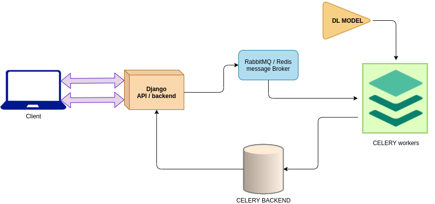

# Commands

Write inside the `django_backend_api/app/` folder:

- To start the celery workers:
> `watchmedo auto-restart -d './'  -p '*.py' -- celery -A app worker --max-tasks-per-child 12 --concurrency=10 --loglevel=INFO
`
- To start the API
> `python manage.py runserver
`

# API architecture

|flow diagram|
|:--------:|
|}|
