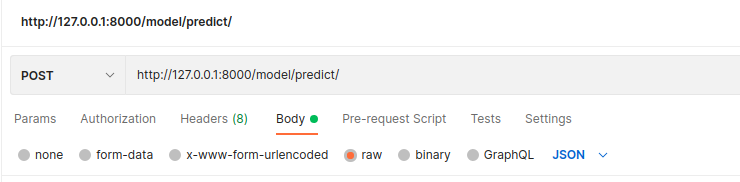

# Introduction

Following diagram shows the basic structure of the API. User sends a POST request to the 
API at URL generated by the FASTAPI app, the api sends back a unique ID, then this id is queried using a GET request, 
if the task related to that specific if has been completed ther API sends results otherwise 
it tells the status of the API.

> This API is based on **FASTAPI**

| Flow Chart |
|:--------------:|
||

# Commands

**Following commands must be run from inside the *celery_with_fastapi* folder on the cmd.** 

------

Run the celery worker app to listen for the tasks. (run in cmd)

> `celery -A worker worker -l INFO  --max-memory-per-child 10000 --concurrency 6`

Following command will run the fastapi server.

> ` uvicorn send_request:app --reload`

# Test API

POSTMAN can be used to test the API, instructions are following:

## SENDING THE POST REQUEST

>Setup a tab using following settings. This is the post request sent to the API. 

|    |
|:--------:|
||

> Sample json request is given below:

> `{"Event":{"Type":"Verify"},"Version":"0.0.0.0","ClientId":"1.0","RequestId":"8714","WebApiUrl":"http://machine.local/pta/api/face_verification","LiveSequence":2,"Sources":["/home/talha/live-face-verification-app/from_mxnet_model.jpg","/home/talha/live-face-verification-app/from_tensorrt_model.jpg","/home/talha/live-face-verification-app/from_mxnet_model.jpg","/home/talha/live-face-verification-app/from_tensorrt_model.jpg","/home/talha/live-face-verification-app/from_mxnet_model.jpg","/home/talha/live-face-verification-app/from_tensorrt_model.jpg","/home/talha/live-face-verification-app/from_mxnet_model.jpg","/home/talha/live-face-verification-app/from_tensorrt_model.jpg","/home/talha/live-face-verification-app/from_mxnet_model.jpg","/home/talha/live-face-verification-app/from_tensorrt_model.jpg","/home/talha/live-face-verification-app/from_mxnet_model.jpg","/home/talha/live-face-verification-app/from_tensorrt_model.jpg","/home/talha/live-face-verification-app/from_mxnet_model.jpg","/home/talha/live-face-verification-app/from_tensorrt_model.jpg","/home/talha/live-face-verification-app/from_mxnet_model.jpg","/home/talha/live-face-verification-app/from_tensorrt_model.jpg","/home/talha/live-face-verification-app/from_mxnet_model.jpg","/home/talha/live-face-verification-app/from_tensorrt_model.jpg","/home/talha/live-face-verification-app/from_mxnet_model.jpg","/home/talha/live-face-verification-app/from_tensorrt_model.jpg","/home/talha/live-face-verification-app/from_mxnet_model.jpg","/home/talha/live-face-verification-app/from_tensorrt_model.jpg","/home/talha/live-face-verification-app/from_mxnet_model.jpg","/home/talha/live-face-verification-app/from_tensorrt_model.jpg","/home/talha/live-face-verification-app/from_mxnet_model.jpg","/home/talha/live-face-verification-app/from_tensorrt_model.jpg","/home/talha/live-face-verification-app/from_mxnet_model.jpg","/home/talha/live-face-verification-app/from_tensorrt_model.jpg","/home/talha/live-face-verification-app/from_mxnet_model.jpg","/home/talha/live-face-verification-app/from_tensorrt_model.jpg","/home/talha/live-face-verification-app/from_mxnet_model.jpg","/home/talha/live-face-verification-app/from_tensorrt_model.jpg","/home/talha/live-face-verification-app/from_mxnet_model.jpg","/home/talha/live-face-verification-app/from_tensorrt_model.jpg","/home/talha/live-face-verification-app/from_mxnet_model.jpg","/home/talha/live-face-verification-app/from_tensorrt_model.jpg","/home/talha/live-face-verification-app/from_mxnet_model.jpg","/home/talha/live-face-verification-app/from_tensorrt_model.jpg","/home/talha/live-face-verification-app/from_mxnet_model.jpg","/home/talha/live-face-verification-app/from_tensorrt_model.jpg","/home/talha/live-face-verification-app/from_mxnet_model.jpg","/home/talha/live-face-verification-app/from_tensorrt_model.jpg","/home/talha/live-face-verification-app/from_mxnet_model.jpg","/home/talha/live-face-verification-app/from_tensorrt_model.jpg","/home/talha/live-face-verification-app/from_mxnet_model.jpg","/home/talha/live-face-verification-app/from_tensorrt_model.jpg","/home/talha/live-face-verification-app/from_mxnet_model.jpg","/home/talha/live-face-verification-app/from_tensorrt_model.jpg","/home/talha/live-face-verification-app/from_mxnet_model.jpg","/home/talha/live-face-verification-app/from_tensorrt_model.jpg","/home/talha/live-face-verification-app/from_mxnet_model.jpg","/home/talha/live-face-verification-app/from_tensorrt_model.jpg","/home/talha/live-face-verification-app/from_mxnet_model.jpg","/home/talha/live-face-verification-app/from_tensorrt_model.jpg","/home/talha/live-face-verification-app/from_mxnet_model.jpg","/home/talha/live-face-verification-app/from_tensorrt_model.jpg","/home/talha/live-face-verification-app/from_mxnet_model.jpg","/home/talha/live-face-verification-app/from_tensorrt_model.jpg","/home/talha/live-face-verification-app/from_mxnet_model.jpg","/home/talha/live-face-verification-app/from_tensorrt_model.jpg","/home/talha/live-face-verification-app/from_mxnet_model.jpg","/home/talha/live-face-verification-app/from_tensorrt_model.jpg","/home/talha/live-face-verification-app/from_mxnet_model.jpg","/home/talha/live-face-verification-app/from_tensorrt_model.jpg","/home/talha/live-face-verification-app/from_mxnet_model.jpg","/home/talha/live-face-verification-app/from_tensorrt_model.jpg","/home/talha/live-face-verification-app/from_mxnet_model.jpg","/home/talha/live-face-verification-app/from_tensorrt_model.jpg","/home/talha/live-face-verification-app/from_mxnet_model.jpg","/home/talha/live-face-verification-app/from_tensorrt_model.jpg","/home/talha/live-face-verification-app/from_mxnet_model.jpg","/home/talha/live-face-verification-app/from_tensorrt_model.jpg"],"Analytics":[{"AnalyticId":4},{"AnalyticId":4}],"TargetVector":[0.046598000000000001,0.039264,-0.012788000000000001,0.021191999999999999,0.018998000000000001,-0.0097420000000000007,0.013096,-0.049563999999999997,0.0020669999999999998,0.077537999999999996,-0.010102,0.019140000000000001,-0.0080420000000000005,-0.005548,-0.0041190000000000003,0.0043119999999999999,0.041512,-0.038408999999999999,-0.016296000000000001,-0.016212000000000001,0.064149999999999999,-0.0020370000000000002,-0.0033340000000000002,-0.021203,-0.021176,-0.115519,-0.0081040000000000001,0.045956999999999998,-0.012026,0.0014220000000000001,0.052084999999999999,-0.006502,-0.015062000000000001,-0.011054,-0.028251999999999999,0.048653000000000002,0.0055129999999999997,0.006097,0.027588999999999999,-0.024778000000000001,0.032266999999999997,0.037019999999999997,-0.047088999999999999,0.011653,-0.077191999999999997,-0.089052000000000006,-0.021787000000000001,-0.016277,-0.057239999999999999,-0.089677000000000007,-0.046785,0.080528000000000002,-0.072623999999999994,0.048014000000000001,0.0045279999999999999,-0.0054219999999999997,0.030682999999999998,-0.035832000000000003,0.042971000000000002,0.043122000000000001,-0.060245,0.012966,0.056075,0.0083829999999999998,-0.043876999999999999,0.039961999999999998,-0.10996300000000001,-0.044769999999999997,-0.037141,0.050042999999999997,-0.060274000000000001,0.083066000000000001,0.0088850000000000005,-0.0082260000000000007,0.051830000000000001,-0.066600000000000006,0.087773000000000004,-0.050728000000000002,-0.030039,-0.0034169999999999999,0.046431,-0.026752000000000001,0.029416999999999999,0.049206,-0.061055999999999999,-0.012616,0.0089280000000000002,-0.041265999999999997,0.012648,0.021884000000000001,0.024312,0.044046000000000002,-0.022131000000000001,-0.051815,0.054938000000000001,-0.038917,-0.042555000000000003,-0.034175999999999998,0.000544,0.017694999999999999,-0.0074809999999999998,0.015717999999999999,-0.011105,0.00070899999999999999,0.0060159999999999996,-0.057646000000000003,-0.012375000000000001,-0.0071939999999999999,0.014421,0.032787999999999998,-0.0069899999999999997,-0.033800999999999998,-0.074748999999999996,0.0032850000000000002,-0.0079819999999999995,-0.058313999999999998,0.029159000000000001,0.0071549999999999999,-0.0097190000000000002,-0.075209999999999999,-0.025364000000000001,0.001407,-0.017077999999999999,0.0036649999999999999,-0.037453,0.026535,0.0011850000000000001,0.041607999999999999,-0.021839999999999998,0.061580999999999997,-0.034849999999999999,-0.041742000000000001,-0.00051699999999999999,0.023956000000000002,-0.048002999999999997,0.12936300000000001,-0.030863000000000002,-0.052340999999999999,0.061601000000000003,-0.014834,0.080946000000000004,-0.018157,-0.047348000000000001,0.049577999999999997,0.047327000000000001,-0.058171,0.056001000000000002,-0.023511000000000001,-0.0094780000000000003,-0.054494000000000001,0.133906,0.0021619999999999999,0.050578999999999999,0.030824000000000001,-0.014553,0.12886300000000001,-0.011077,-0.0065160000000000001,-0.0049610000000000001,0.020077000000000001,0.013851,0.042964000000000002,-0.024631,0.034495999999999999,-0.030318000000000001,0.027611,-0.020844999999999999,0.011979,-0.018914,-0.036776000000000003,-0.048235,-0.060873999999999998,-0.009861,0.037789000000000003,0.0062880000000000002,0.057431000000000003,-0.055057000000000002,0.044767000000000001,0.073093000000000005,0.051685000000000002,-0.040772999999999997,0.021142999999999999,-0.018667,0.050583000000000003,-0.0027390000000000001,-0.037600000000000001,-0.0022899999999999999,-0.021971999999999998,-0.011833,0.040987999999999997,0.032993000000000001,0.058001999999999998,0.065698000000000006,0.020414000000000002,-0.042838000000000001,-0.031005000000000001,-0.030182,-0.0080129999999999993,0.038282999999999998,0.026759999999999999,0.032400999999999999,-0.011860000000000001,-0.0088039999999999993,0.067933999999999994,0.019959000000000001,0.025267000000000001,-0.042783000000000002,-0.032511999999999999,-0.065351999999999993,0.034472999999999997,-0.0098309999999999995,-0.0068739999999999999,-0.061955000000000003,-0.040967000000000003,-0.0031059999999999998,0.042592999999999999,-0.00045300000000000001,0.0069629999999999996,-0.040075,-0.057904999999999998,-0.164189,0.052505999999999997,0.079782000000000006,-0.032599000000000003,0.049979999999999997,-0.034247,0.026509999999999999,0.034859000000000001,0.049105999999999997,-0.028067999999999999,-0.017263000000000001,0.016327999999999999,-0.014952,-0.080264000000000002,0.020397999999999999,0.0039639999999999996,-0.074282000000000001,0.016268000000000001,-0.094517000000000004,-0.068877999999999995,-0.039696000000000002,-0.013583,0.037309000000000002,-0.048988999999999998,0.044741999999999997,-0.028124,0.072805999999999996,-0.027552,-0.0048139999999999997,-0.016957,-0.036998999999999997,-0.035996,0.062939999999999996,0.05008,-0.0082269999999999999,-0.016195999999999999,0.060947000000000001,-0.019529000000000001,0.031629999999999998,0.0027620000000000001,0.013610000000000001,-0.001322,-0.00046700000000000002,-0.073079000000000005,0.016215,-0.006293,0.055273999999999997,0.012651000000000001,0.089844999999999994,-0.022415000000000001,0.0078930000000000007,0.0050179999999999999,0.0085489999999999993,0.048937000000000001,0.0049620000000000003,-0.042256000000000002,-0.038343000000000002,0.0079410000000000001,0.0036110000000000001,0.036551,-0.022193999999999998,0.03925,-0.0072290000000000002,-0.010897,-0.098019999999999996,0.05219,-0.077160000000000006,0.054934999999999998,-0.020840999999999998,0.037638999999999999,0.063321000000000002,-0.010213,-0.047140000000000001,-0.012337000000000001,-0.015892,-0.074010000000000006,0.015570000000000001,0.095089999999999994,-0.037127,-0.039399000000000003,-0.020133999999999999,-0.090232999999999994,-0.017184000000000001,0.016833999999999998,-0.019841999999999999,-0.084828000000000001,0.040160000000000001,-0.017221,0.0022650000000000001,-0.031223999999999998,-0.017593000000000001,-0.096878000000000006,0.13952999999999999,0.020847000000000001,-0.040693,-0.030647000000000001,0.032334000000000002,0.019713000000000001,-0.042136,-0.012531,0.089124999999999996,0.0040470000000000002,0.027425999999999999,-0.019036000000000001,0.025530000000000001,-0.0080660000000000003,-0.032627999999999997,0.020229,0.0089219999999999994,0.038656999999999997,0.015953999999999999,0.067360000000000003,0.059032000000000001,-0.018537000000000001,-0.070943999999999993,-0.018734000000000001,0.045405000000000001,-0.063205999999999998,0.046866999999999999,0.083113999999999993,-0.032467999999999997,-0.054632,0.026329999999999999,-0.028641,0.071267999999999998,-0.038684000000000003,0.013487000000000001,0.026641999999999999,-0.0044060000000000002,0.049206,0.028138,0.020147999999999999,-0.013783,-0.080607999999999999,0.056285000000000002,-0.059220000000000002,-0.011358999999999999,0.0019959999999999999,0.067210000000000006,-0.089648000000000005,0.002647,-0.019456999999999999,-0.085237999999999994,-0.038233999999999997,0.024738,0.055704999999999998,0.101687,0.044456000000000002,0.059756999999999998,-0.0073730000000000002,0.058311000000000002,0.01349,-0.087915999999999994,0.0042729999999999999,0.022218000000000002,-0.034707000000000002,0.096684999999999993,0.0059560000000000004,-0.003186,0.107628,0.004169,-0.065517000000000006,-0.078608999999999998,0.011145,0.11037,0.135382,-0.048429,0.018234,0.00266,-0.099126000000000006,-0.010439,0.023852000000000002,0.0020349999999999999,0.010511,0.024854000000000001,-0.047052999999999998,-0.0032529999999999998,0.014229,-0.030074,-0.0094020000000000006,0.016767000000000001,0.031820000000000001,-0.091208999999999998,-0.068451999999999999,-0.031203000000000002,0.00045600000000000003,0.037612,0.054156999999999997,-0.0049909999999999998,-0.037157999999999997,0.030518,-0.0080199999999999994,-0.031875000000000001,-0.018709,0.072596999999999995,-0.034132000000000003,0.068391999999999994,0.0058609999999999999,-0.0069709999999999998,0.0020530000000000001,0.012674,-0.020235,-0.021399000000000001,-0.024184000000000001,0.0048770000000000003,-0.018464999999999999,0.025179,-0.067648,0.048839,-0.0055919999999999997,-0.0026350000000000002,-0.086274000000000003,-0.052491999999999997,-0.026151000000000001,-0.00064999999999999997,-0.021010999999999998,0.0086580000000000008,-0.032934999999999999,0.0035170000000000002,-0.006803,0.012695,-0.074715000000000004,-0.025616,-0.031105000000000001,0.034972000000000003,0.0020149999999999999,0.040717000000000003,-0.0082830000000000004,0.033806999999999997,0.013283,0.001031,0.039773999999999997,0.044662,-0.088602,-0.0081670000000000006,0.041478000000000001,0.086195999999999995,-0.014114,-0.029593999999999999,0.022384999999999999,-0.048348000000000002,0.020698000000000001,-0.049110000000000001,0.0075859999999999999,-0.00057399999999999997,0.022721000000000002,-0.021683999999999998,-0.074218999999999993,-0.017125000000000001,0.024091000000000001,0.026998000000000001,-0.0095560000000000003,0.00093400000000000004,-0.022088,0.034591999999999998,0.051570999999999999,-0.020166,-0.0040619999999999996,0.083780999999999994,0.022894000000000001,-0.0084209999999999997,-0.062362000000000001,-0.026078,0.0067669999999999996,-0.078934000000000004,0.036125999999999998,0.00033500000000000001,-0.032396000000000001,-0.033340000000000002,-0.020854000000000001,0.034319000000000002,0.026012,-0.045294000000000001,0.033244999999999997,-0.037930999999999999,-0.031073,0.011962,0.027838999999999999,-0.044826999999999999,-0.057547000000000001,-0.053620000000000001,-0.053413000000000002,-0.050902999999999997,-0.027067999999999998,-0.0075329999999999998,0.077115000000000003,0.0054720000000000003,0.083717,0.0071549999999999999,-0.023755999999999999,-0.028684999999999999,-0.0567]}`

> Send this json format POST request like this 

|         |
|:--------:|
||

> The API gives response like shown below, copy this id (it will be used to get results):

|         |
|:--------:|
||

## GETTING THE RESULTS

> Setup another tab in POSTMAN like as show below, it will be a GET request:

|          |
|:----------:|
||

> Send query like this with that unique id that api gave in response (in the previous step) 

> Result will be like this if task has been completed:

> **If task is still in process, then it will send the status in response**

## Using python script

[sendMultiReq](./sendMultiReq.py) is a simple script to send 10 requests at once with 40 images per request, while the
model predicts using batch size of 1. Use following command to send the requests.

> `python sendMultiReq.py`

# Important Note
 - HELP has been taken from [this](https://towardsdatascience.com/deploying-ml-models-in-production-with-fastapi-and-celery-7063e539a5db) article
 - POST request input (sent to `http://127.0.0.1:8000/model/predict/`) should be JSON type (the sample of which is shown [here](#sending-the-post-request))
 - GET request input (sent to `http://127.0.0.1:8000/model/result/`) should be query type (like `http://127.0.0.1:8000/model/result/?task_id=732aa2a0-21c1-446b-ad83-a0a737ef99f4`)

